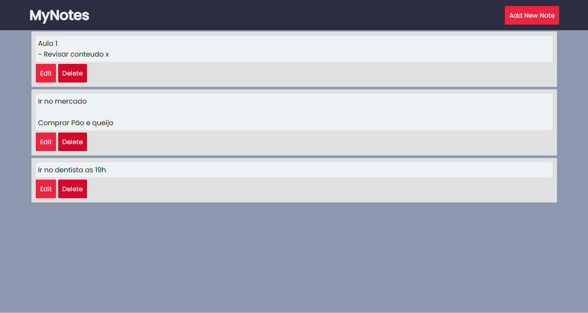

<h1 align="center">My Notes</h1>

<hr>
###Status - Em Construção :construction:

<p align="center">
 <a href="#-sobre">Sobre o projeto</a> •
 <a href="#funcionalidades">Funcionalidades</a> • 
 <a href="#layout">Layout</a>
</p>
<p align="center"> 
 <a href="#Como">Como executar o projeto</a> • 
 <a href="#tecnologias">Tecnologias</a> • 
 <a href="#autor">Autor</a> • 
 <a href="#licença">Licença</a> 
</p>
<hr>


###Sobre o Projeto:
<p>Uma aplicação para a criação de notas.

<hr>

###Funcionalidades:
- [x] Adicionar notas<br>
- [x] Editar notas
- [x] Excluir notas
- [ ] Apresentar data e hora
- [ ] Funcionar em formato markdown

<hr>
###Layout:
<h5>Web</h5>


###Como executar o projeto:

```bash
# Clone este repositório
$ git clone https://github.com/HerikCosmo/my-notes.git

# Abra o arquivo index.html no browser 
```

<hr>

###Tecnologias:
As seguintes ferramentas foram usadas na construção do projeto:
- HTML5
- CSS3
- JavaScript

<hr> 

###Autor:


Feito por Herik Cosmo!
<a href="maito: herikcosmo.m@gmail.com" target="_blank">
  
</a>

<a href="https://www.linkedin.com/in/herik-martins-3194b4208" target="_blank">
  
</a>
<hr>
### Licença:

Este projeto esta sobe a licença [MIT](./LICENSE).
